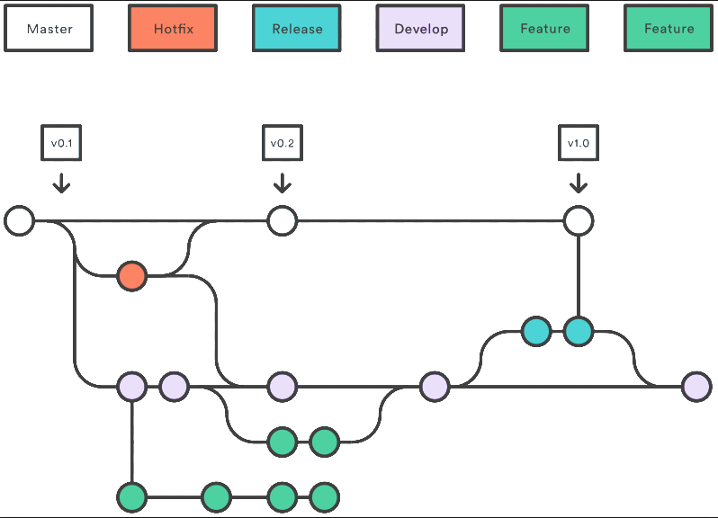
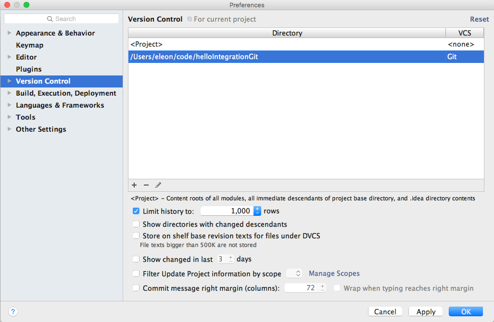
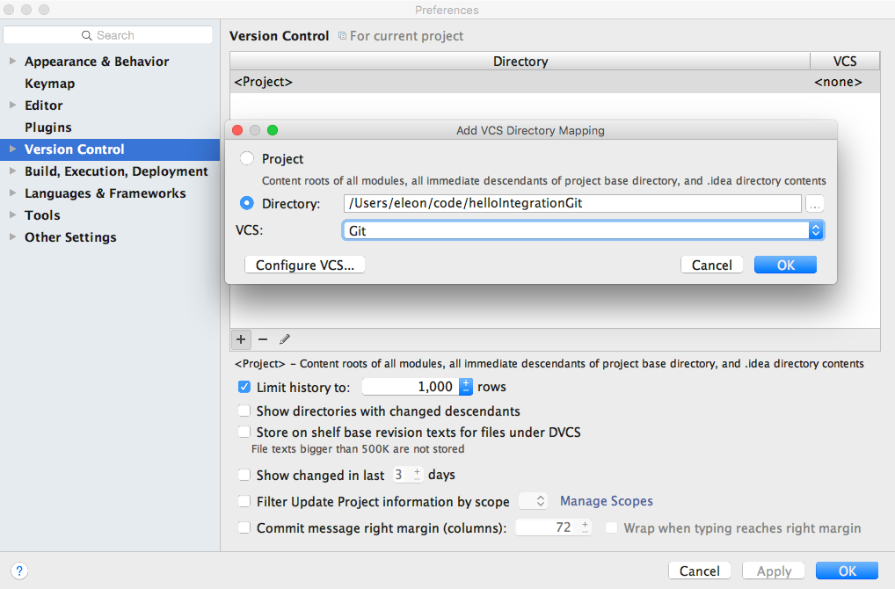
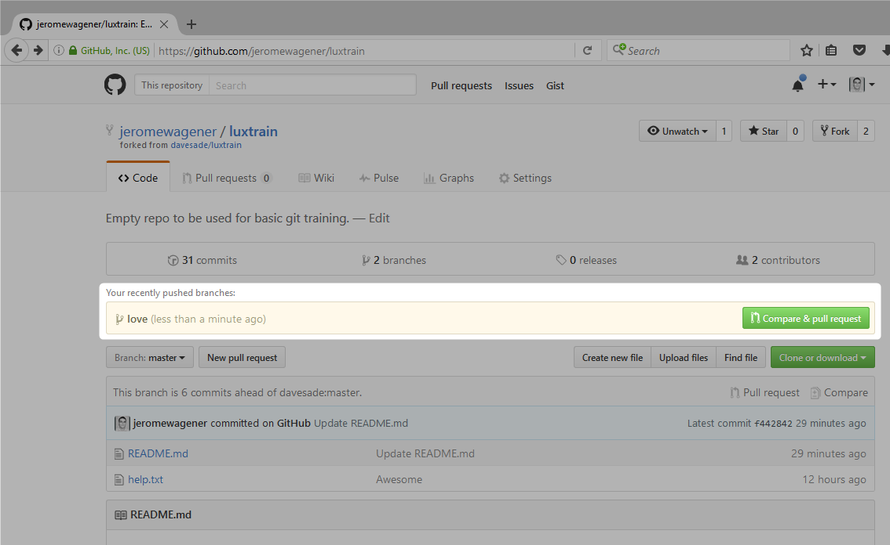
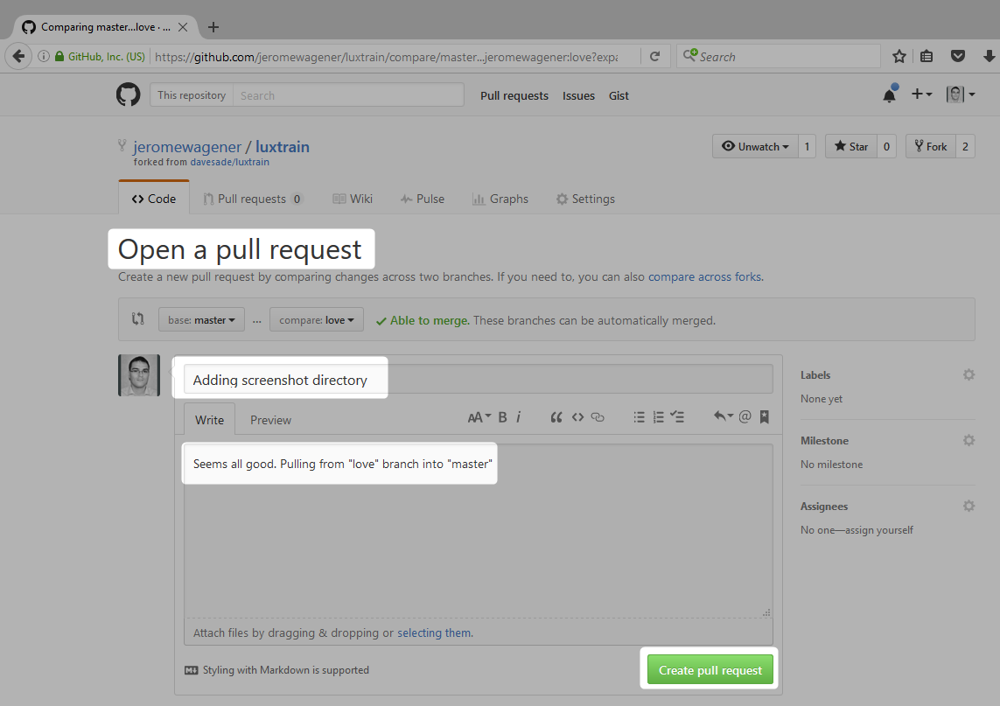
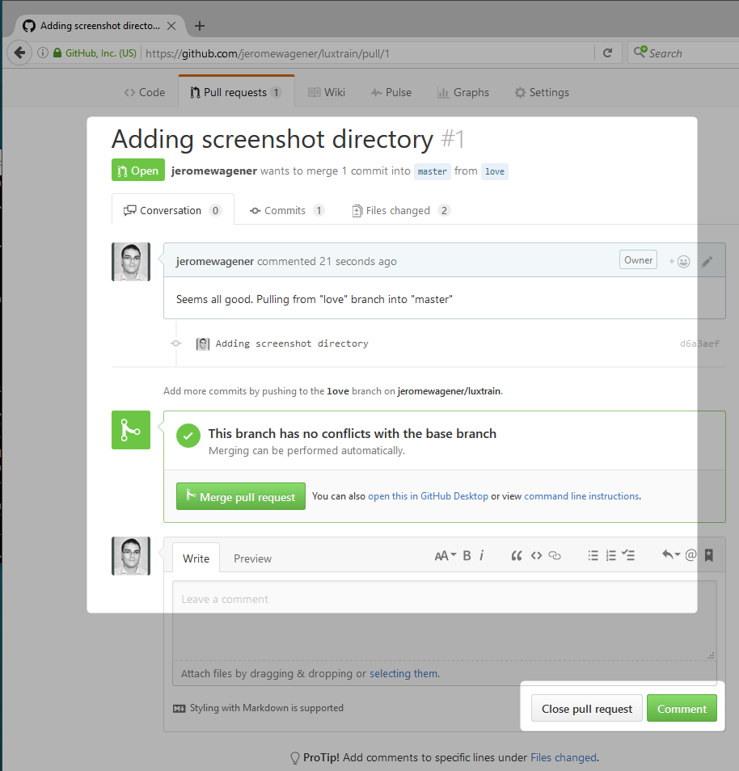
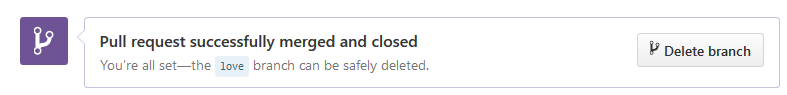
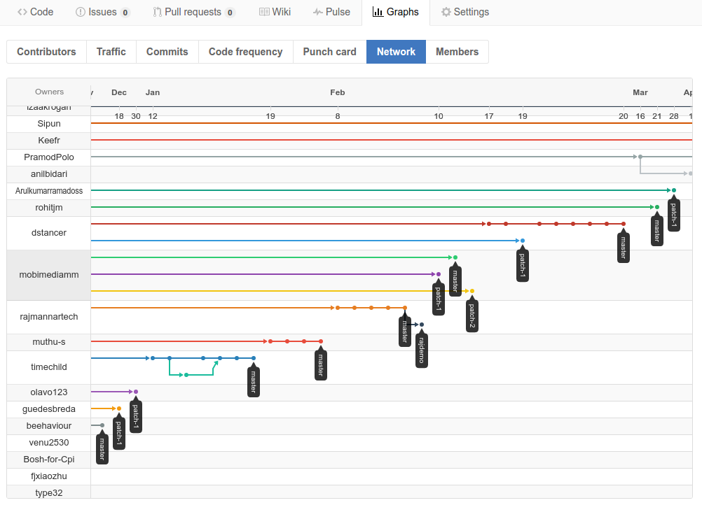

Training instructions for GitHub (Enterprise)
===========================

#Contents:
* [Git Overview](#gitOverview)
* [Installation](#installation)
* [Starting from existing repository on a server](#startingWithExisting)
* [Starting from scratch](#fromScratch)
* [Branching](#branching)
* [Tagging](#tagging)
* [Pull Requests](#pullRequests)
* [Forks](#forks)
* [Migration Notes](#migrationNotes)
* [Important Literature](#literature)

##<a name="gitOverview"></a>Git Overview

### Git in a nutshell

#### Working remotely with origin server
 
At normal circumstances, even when you work remotely and disconnected from main server, you always work with complete repository. All changes in the code has to be pushed to origin server (and usually there is only one origin) and in case you need to update your local repository, you have to pull (or fetch + merge / rebase) from origin. To avoid potential conflicts while pushing or pulling, it is advised to have developer's branch created. Conflict are going to be solved when merging branches later in the process (see [Pull Requests](#pullRequests).


#### Difference between REL and DEV organization
 
**REL** organisation is handled only by SCM/CFM and it should contain only **production code**. At the beginning, empty repositories were created and forked into **DEV** organisation. Teams of developers are having write access into their repositories, however by default, read access is allowed for every member of DEV organisation, allowing to search, comment, fork and contribute virtually to any project. At the beginning, empty repositories were created in REL organisation and then forked to DEV, allowing simple pull request to receive right version of source code for further processing. Developers pushed their latest and release branches from Clearcase to previuosly mentioned forks in DEV organistaion and commiting their work to GitHub only since.

#### Branching ala Gitflow workflow
 
There are many ways of work organisation, so we took inspiration from existing workflows. There are no limits, each team might prefer different approach and it is fine to do stuff your way.

 

##<a name="installation"></a>Installation

### Where to get installation files
```
https://git-scm.com
https://desktop.github.com/
```
### How do I setup Git in Eclipse, Netbeans or IntelliJ



Go to Preferences, then Version Control



Click under the '+' icon. Select Git as VCS.


Click OK

### How do set the Git proxy in case you want to access an external GitHub repository (Not needed for the internal Enterprise installation):
```
git config --global http.proxy proxy_url
```

##<a name="startingWithExisting"></a>Starting from existing repository on a server
###Clone
This will be probably most common practice for most of us. You would like to start contributing to existing project. Cloning repository will create local copy on your workspace, however your origin is still on main server.

With Git, you **ALWAYS** work with a complete repository, even on your local PC! That's why it's called **distributed version control system**. There is usually a single point/place - main server - where the project is being located. This main server is then shared between many developers which push their contributions to this remote origin. In short: The easiest way to start contributing to an existing project is to **clone** it from a server. Let's do it right now!
```
git clone https://github.com/davesade/luxtrain
Cloning into 'luxtrain'...
remote: Counting objects: 37, done.
remote: Compressing objects: 100% (31/31), done.
remote: Total 37 (delta 4), reused 20 (delta 1), pack-reused 0
Unpacking objects: 100% (37/37), done.
Checking connectivity... done.
```
As you can see, this command created a folder and fetched all necessary data. This includes the complete repository, all files, all branches and all tags.

###Pull, Fetch, Merge, Rebase
If you would like to receive all changes since your last pull from origin server, you can choose from one of few good ways.
```
git pull origin master
```
Pull will update your local Git index and also download all new data, commit history and automatically merge changes where possible. This makes sense in moments, when you work on your own branch, so you do not expect any conflicts.

Sometimes, you don"t want to do automatic merge, so you would like to only update your local index and then choose, what to merge.
```
git fetch
```
You can now simply merge all.
```
git merge
```
Or you can choose, which branch exactly from origin server you want to merge with your local repository.
```
git merge origin/master
```
After a merge, you might want to rebase your branch, to align with newest version of remote branch you started from (base).
```
git rebase origin/master
```

##<a name="fromScratch"></a>Starting from scratch

### Create a new folder
There are a few ways how to start with Git and we will first have a look at the simplest possible example. In fact, we would like to start with brand new merely empty repository locally on your PC where Git is installed. Let's move to safe area, where we can prepare a folder for our new repository.

```
mkdir luxtrain
cd luxtrain
git init
Initialized empty Git repository in /luxtrain/.git/
```
#### Create a new document
Now we have to create some content, let's have simple TXT file.
```
echo "Save our souls" >> help.txt
```
This file is saved in the previously created folder on the filesystem, but we have to inform Git about it. This can be done simply by adding new file to the repository.
```
git add help.txt 
```
> **Tip:** Or you could just write **git add .** to add all files in the folder

Next we have to commit our changes, to really let Git know, that our work with help.txt file is done.
```
git commit -m "First commit"
 [master (root-commit) c032da3] First commit
 1 file changed, 1 insertion(+)
 create mode 100644 help.txt
```
>**Tip:** Consider commit messages as an important part of your workflow. It WILL greatly help, when tracking changes in the past. It is oftentimes a good idea to also put SIRe numbers or generally ticket numbers in this message. __(E.g. SIR 12345 : Fix CSS display bug of dropdown menu)__

#### Publish a document
Let's say we are happy with our work, and it is now time to publish our work on the main server. To do that, we have to add a remote location, by default called **origin**. In our example, let's use public GitHub.com, but it works the same also for GitHubEnterprise.

```
git remote add origin https://github.com/davesade/luxtrain
```
>**Tip:** In Git vocabulary, "origin" indicates the default place for your future commits, which is usually shared by whole team. By the way: You can set multiple remotes to support pushing your code to multiple servers. (e.g. Heroku Git)

>**IMPORTANT:** You have to prepare an empty repository on the GitHub server in advance! This is usually not a big deal and if you follow the instructions on the webgui properly, it will actually show you all commands you have to do on your workstation, to push data from your local PC.

Last thing to do is actually to push our changes. That follow this syntax:
```
git push [remote] [branch]
```
Branching is important part of your development strategy and we will talk about it later. In case you are not sure, you can simply list all branches in your repository. By default, you should see a master branch.
```
git branch
*master
```
Asterix indicates your current branch. In case you have too many branches to look around, you can use also status command:
```
git status
On branch master
```
Alright, so finally now we can push our work to the server!
```
git push origin master
Username for 'https://github.com': davesade.42@gmail.com
Password for 'https://davesade.42@gmail.com@github.com': 
Counting objects: 3, done.
Writing objects: 100% (3/3), 228 bytes | 0 bytes/s, done.
Total 3 (delta 0), reused 0 (delta 0)
To https://github.com/davesade/luxtrain
 * [new branch]      master -> master
```
**Congratulations**, you just pushed your first commit!

##<a name="branching"></a>Branching
###Basics
With branches, you can organise your work in case you have to synchronise with more colleagues that are contributing to the same project. You can create new branch at any time by typing:
```
git branch love
git branch
  love
* master
git checkout love
git branch
* love
  master
```
Now you are ready to work in your **love** branch, without being afraid of interrupting your colleagues working on different features.

But there is actually a faster way of creating branch. In fact, when you are checking out a branch which doesn't exists, you can add the **-b** argument to create a branch automatically based on another branch you specify. (typically master)
```
git checkout -b love master
```

>**Tip:** There is no single winning strategy about branching. GitHub workflow is heavily relying on the assumption that:
1. each developer commits to it's own branch and 
2. then pushes it into main branch (master or main feature branch) and 
3. then raise a pull request
In case of small changes or quick bugfixes, you might easily delete a branch after you fix your issue. (typically SIRe fixes) However in case of feature branches, it is recommended to keep it for easier tracking.

Now, do not forget to (1) add (2) commit and (3) push your changes when you are done working:
```
git add .
git commit -m "Second commit"
git push origin love
```
Each team should come up with its own strategy on branching. In case you would like to delete a branch (perhaps after you pushed your changes to origin server), you can type:
```
git branch love -d
```
You can also delete branch on remote origin.
```
git push --delete origin [branch name]
```
In any case, when using Pull Requests on GitHub webpage, you will have opportunity to delete a branch after successfull merge. 

##<a name="tagging"></a>Taging
Now we know how to start working in our local repository, how to do branching and how to push our branches to main server. At one point of time, we would like to ask CFM to actually pick our work and send it to the pipeline for further testing and deployment, up to production. To do that, you have to provide a **tag**, which is the equivalent of a **label** in Clearcase. To add a new tag, type the following command:
```
git tag v.0.2 -m "Please test this in production"
```
Tag message is not mandatory, but it could help. Now you can look for this information, for example:
```
git tag
v.0.2
git show v.0.2
-> tag v.0.2
Tagger: David Kubec <davesade.42@gmail.com>
Date:   Mon Aug 1 23:35:18 2016 +0200

Please test this in production

commit 4f0c35b344480f5e7b69e52c6c1f805f79bdc18d
Merge: ad9f48e 29dbb5b
Author: David Kubec <davesade.42@gmail.co,m>
Date:   Mon Aug 1 23:22:47 2016 +0200

    OKMerge branch 'love' of https://www.github.com/davesade/luxtrain into love
```
In case you would like to add a annotaion tag, you can add the **-a** parameter. You can still add a tag message.

>**IMPORTANT:** Tags are NOT pushed to origin server by pushing the branch.

You have to push to origin with name of the tag, instead of branch name.
```
git push origin v.0.2
Counting objects: 1, done.
Writing objects: 100% (1/1), 180 bytes | 0 bytes/s, done.
Total 1 (delta 0), reused 0 (delta 0)
To https://www.github.com/davesade/luxtrain
 * [new tag]         v.0.2 -> v.0.2
```
>**Tip:** You cannot create a tag via the webgui of GitHub Enterprise.

If you would like to remove a tag, just type:
```
git tag [tag_name] -d
-> Deleted tag [tag_name] (was 4f0c35b)
```
And if you need to remove a tag from remote origin, type this:
```
git push --delete origin [tag_name]
```
Now you are ready to raise your **EEPR** in Amadeus. CFM expects a **tag** indicating an unchangeable point in time (revision) for their pipeline. You can simply mention tag in the comment of EEPR.

##<a name="pullRequests"></a>Pull requests

###Raising new pull request
It is not uncommon that bigger teams have to organise their contributions using multiple branches. Before taging the final product to be sent down the pipeline, teams have to merge all changes from all relevant branches. To have an overview and control over the merge process, it is usual to have a main coordinator (e.g. head of team) which is responsible for merging all the code while the developer might be responsible for fixing the conflict. From developer perspective, this is best to be done by raising a pull request. This way developer the says: "My work is done, everything is on the server, please merge it into master or main feature branch".

Let's assume, that we just pushed the **love** branch to main server.
```
git push origin love
```
Now have a look at your repository via web browser, you will notice a new button for raising pull request. 



Select **master** as a base and compare it with **love**. GitHub will show you differences and allows you to write a comment and start discussion.




>**IMPORTANT:** Pull requests in GitHub should be close to an actual discussion about the changes you would like to merge. Use this opportunity to ask colleagues for opinions, help or review. Use @mentions to reach other people from totally different projects in order to have them contributing into your work. Use #numbers to relate your changes to existing GitHub issues. Consider this as cultural thing, to show your work publicly and to share and exchange ideas. Obviously there might be smaller teams, which are going to commit directly to the master branch or maybe they will merge their own pull requests in case of minor changes.

>**IMPORTANT:** While Git does offer a pull request command as well, it serves merely as a check for potential merges. It is simply not possible to raise pull request for GitHub via the command line interface of Git. Pull requests are a dedicated feature of GitHub, where you have to use the webgui.

There might be situation to refuse the pull request. Simply click on the **close** button in these cases.

Last but not least, if a branch is no longer needed, you can delete it via the webgui or the command line.



##<a name="forks"></a>Forks (slightly advanced, but still recommended)
You can consider forking as very powerfull method of parallel evelopment, which is recommended as advanced technique. In a nutshell, it is like creating "branches of repositories". In case you have access to selected repository, you can create your own branch and work as usuall. But it also means, that for each merge you have to raise a pull  request and wait for approval (in case you lack privileges). Nothing wrong with that. But in case, you don't have access to repository or   in case you would like to start brand new development based on existing repository, then you can create a fork. Forked repository   then moves to new URL (typically your own namespace on GitHub) and then you can do whatewer you want. Later on, you can raise a pull   request, exactly the same way, as in case of merge of branches - in reality you are merging two branches from two different repositories, which are linked with the fork.
>**IMPORTANT** Inside forked repository, you have admin access, so you can not only do merge of any branches, but also to delete it. It will not affect original repository, until you raise a pull request.



##<a name="migrationNotes"></a>Migration Notes
* All old/existing code will remain on Clearcase for at least another ten years. This way you can always go back to check what exactly happened before the migration.
* Before your first EEPR, give CFM a heads up as they need to adapt their scripts. This will take a few days.
* There is a script that helps you migrating Clearcase VOBs to Github Repositories
* You need to adapt your Jenkins to fetch the code from the new locations. For this you need to use the following plugins installed on Jenkins
 * GitClientPlugin
 * GitPlugin
 * Github API Plugin
* You will also need a technical user for Jenkins as well as other administrative tasks. Otherwise somebody from the team will have to use his personal account to do the initial migration etc.. In which case, Jenkins would also use these credentials...
* How to migrate in a nutshell *(assuming you want to migrate the old Clearcase VOB called WebApplicationVob to the new Github Repo called WebApplicationRepo)*
```
bash
# First, create a new empty reposity called WebApplicationRepo using GitHub
# Copy the repository URL as we need it later. It will end in .git and can be retieved using the clone button
# Normally, all repositories have already been created for us and we just need to populate them with our files

# Change into the command line and type
mkdir WebApplicationRepo
cd WebApplicationRepo
git init

# Copy everything you want to migrate into the newly initialized repository
cp -rf ../WebApplicationRepo .
git add .
git commit -a - m "initial commit"

# Set the remote location using the URL from the webgui
git remote add https://github.com/davesade/WebApplicationRepo.git

# push to the origin and you are done!
git push -a origin master
```

##<a name="literature"></a>Important Literature
* https://www.atlassian.com/git/tutorials/what-is-git *(For every topic covered above, additional explanation can be found here)*
* https://www.atlassian.com/git/tutorials/comparing-workflows/ *(Really recommanded!)*
